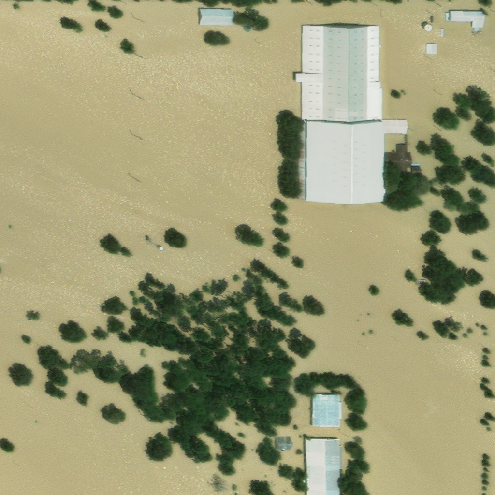

# Introdução
A resposta a desastres naturais exige informações rápidas e precisas para garantir uma ação eficiente e direcionada. Nesse contexto, imagens de satélite desempenham um papel essencial ao permitir a análise de áreas afetadas, identificação de causas e avaliação da gravidade dos danos. Contudo, o uso direto dessas imagens é limitado sem a realização de anotações detalhadas, processo que demanda tempo e esforço humano significativo. Inspirado na competição xView2, este trabalho aborda a automatização da classificação de desastres naturais em imagens de satélite, visando aprimorar a assistência humanitária.

Dado o escopo acadêmico e temporal do projeto, restringimos o problema para focar na detecção do tipo de desastre que atingiu uma área específica. Além disso, exploramos a hipótese de que o aumento do dataset por meio da geração de imagens sintéticas pode contribuir para melhorar a performance de modelos preditivos, uma vez que datasets robustos e balanceados são escassos.

Neste trabalho, abordamos o desenvolvimento de uma baseline utilizando Redes Neurais Convolucionais baseadas na arquitetura ResNet, e conduzimos experimentos de aumento de dados com técnicas de geração de imagens, como o Stable Diffusion ajustado via Dreambooth. A análise inclui impactos das imagens geradas na performance do modelo, buscando validar a hipótese de que dados sintéticos podem enriquecer o treinamento em cenários reais.

# Problema

O problema foi inspirado na competição "https://xview2.org/", onde a motivação está no fato de que informações rápidas e precisas são essenciais para uma resposta eficaz a desastres. Para isso, é necessário saber a área afetada, a causa e a gravidade dos danos - nisso, imagens de satélite são uma excelente forma de fazer essa comunicação. No entanto, a imagem por si só não tem tanto valor, sendo necessário realizar uma anotação manual para poderem ser comunicadas - e é nisso que a competição se baseia - anotação automatizada dessas imagens para deixar a assistência humanitária mais eficiente.  

Partindo disso, limitamos o escopo da competição para ser compatível com o escopo e tempo de trabalho para a disciplina, onde selecionamos somente a parte do problema que se refere a descobrir que tipo de desastre natural afetou certa área. A relevância dessa detecção está tanto na rápida resposta, quanto em decidir que tipo de socorrista deve ser enviado para tomar as devidas ações.

Além disso, percebemos que a disponibilização de imagens de qualidade desse tipo não é algo tão fácil, recorrente e abundante, mesmo porque não estão acontecendo desastres de todos os tipos o tempo todo. Portanto, para contribuir ainda mais com o escopo do trabalho, pensamos em usar esse problema para testar a hipótese de que gerar imagens desse tipo para aumentar o tamanho e variabilidade do dataset pode contribuir para a performance de modelos detectores desses desastres.

<div style="display: flex; justify-content: space-between; align-items: flex-start;">
    <figure style="margin: 0 10px; text-align: center; width: 45%;">
        
        <figcaption>Antes do desastre "Hurricane Harvey"</figcaption>
    </figure>
    <figure style="margin: 0 10px; text-align: center; width: 45%;">
        
        <figcaption>Após o desastre "Hurricane Harvey"</figcaption>
    </figure>
</div>

# Objetivos

* Desenvolver um classificador para detectar se a área realmente foi afetada por algum desastre.
* Testar a hipótese de que a geração de imagens para aumento da quantidade e variabilidade dos dados pode melhorar a performance dos modelos.

# Dados

Como os dados originalmente são feitos para segmentação, criamos os rótulos "Com Desastre" e "Sem Desastre" com base no nome associado ao arquivo das imagens, visto que elas são organizadas em pares: dado um desastre, temos a mesma imagem pré e pós o seu acontecimento. Justamente por conta disso, as duas classes são exatamente balanceadas: 5598 dados no total, com 2799 imagens para cada uma.

Além de uma análise simplesmente binária, também será conduzido uma análise ao longo do trabalho com base na distribuição dos 10 tipos de desastres, conforme o gráfico abaixo, onde é perceptível o desbalanceamento entre eles. Ainda nesse quesito, foi tomado a decisão de remover o "guatemala volcano" pela pouquíssima quantidade de dados.

Nem todos os dados possuem uma boa qualidade e representatividade do desastre em questão, o que pode impactar diretamente o experimento realizado com base nas amostras que forem selecionadas para validação e teste.


# Metodologia

## Classificação com Rede Neural

Para a construção da baseline do classificador, utilizamos uma arquitetura baseada na ResNet, implementada manualmente para garantir flexibilidade e personalização ao projeto. Para treiná-la e avaliá-la, dividimos o dataset em splits de treino (80%), validação (10%) e teste (10%).

Para manter a comparação do classificador baseline com o classificador com imagens geradas justas, fixamos os splits de dados, e os hiperparâmetros, mantendo:

* Otimizador =  Adam
* Learning Rate = 0.0005
* Batch Size = 32

### Estrutura da Baseline

Nossa implementação consiste nos seguintes componentes principais:

1. **Bloco Residual (ResidualBlock)**:

   - Cada bloco residual possui duas camadas convolucionais seguidas por normalização em lote (Batch Normalization) e ativação ReLU.
   - Conforme a teoria lançada pela ResNet, implementamos atalhos (skip connections) que adicionam diretamente a entrada do bloco à saída convolucional, na ideia de evitar o desaparecimento do gradiente ao longo das layers. Quando há diferenças de dimensões entre a entrada e a saída, utilizamos uma Conv2d 1x1 para ajustá-las corretamente.
2. **Camadas da ResNet**:

   - A rede começa com uma camada convolucional inicial que tem como input imagens 512x512x3, e que aumenta a profundidade das imagens para 64 canais, seguida por uma Batch Normalization, uma ReLU e uma camada de max pooling para reduzir as dimensões espaciais.
   - Quatro blocos residuais consecutivos são utilizados, com o número de map features aumentando progressivamente (64, 128, 128 e 256 canais). Todos utilizam "stride=2" para realizar a redução de dimensionalidade conforme as ativações passam pelas layers.
3. **Camadas Finais**:

   - Após os blocos residuais, uma camada de global average pooling reduz a saída para um único vetor de características por canal.
   - A saída é então passada por uma MLP, que produz a classificação final.

### Motivação da Escolha da ResNet

A ResNet foi escolhida devido a implementação de blocos residuais, que ainda fazem parte de arquiteturas amplamente utilizadas nas redes mais modernas de visão computacional, uma vez que conseguiram mitigar muito bem o problema de desaparecimento de gradiente. Além disso, a arquitetura da rede é robusta por si só e, por isso, tentamos aplicar o mais fiel possível à implementação original, mas adaptada ao nosso poder computacional e particularidades do nosso problema.

O intuito da baseline é gerar métricas iniciais em relação ao nosso problema para, posteriormente, podermos comparar o impacto da geração de imagens como data augumentation.

## Análise de escolha de desastre para o processo de Data Augmentation

Para testar o impacto da geração de imagens nesse contexto, idealizamos testar o aumento de somente alguns tipos de desastres, até para também fazer uma tentativa de balanceio no dataset. Para isso, levando em consideração esse fator, realizamos algumas amostragens para visualizar imagens de cada classe, com o objetivo de, no ponto de vista humano, identificar os desastres mais facilmente perceptíveis, visto que deveríamos começar realizando os experimentos supostamente pelas imagens mais "fáceis" para o modelo gerar. Ao fim, o grupo concluiu que os desastres "midwest-flooding" e "santa-rosa-wildfire" se encaixam bem nesses dois fatores levantados e, por isso, deveriam passar pelo experimetno de data augmentation.

## Data Augmentation com Stable Diffusion

Para realizar os testes de aumento de dados a partir da geração de imagens no nosso dataset, utilizamos o modelo de difusão "Stable Diffusion", justamente por ser uma arquitetura "estado da arte" da geração de imagens "text2image" open-source, tendo ultrapassado abordagens baseadas em GANs (Generative Adversarial Networks), ou somente em VAEs (Variational Autoencoders).

### Experimentos com modelo pré-treinado

Foram testados as versões 1.4, 1.5, 2.1, e 3.5-medium disponibilizadas no Hugging Face pela Stability Ai, onde os prompts (um para cada desastre) foram ajustados a cada experimento com os mesmos, conforme o resultado da geração. Ao fim, o 2.1 foi escolhido pensando no balanceamento entre desempenho e custo computacional, e os prompts finais para geração de cada tipo de desastre foram finalizados como:

* Geração de imagens de "wildfire":

```
    Satellite photo of a wildfire-affected rural area with green forest patches, scorched earth, dirt paths, and light smoke. Captured during daylight with a focus on natural textures and contrasts between burned and untouched vegetation.
```

* Geração de imagens de "flooding":

```
    Satellite photo of a flood-affected rural landscape showing muddy brown water covering fields and partially submerged green vegetation. Visible remnants of dirt roads, scattered structures, and subtle water ripples add texture. Variations in water levels and contrasting patches of green and brown create a realistic, natural scene under daylight.
```

### Ajuste Fino com Dreambooth

Com os resultados da geração de imagens através de um modelo somente pré-treinado, percebemos que os resultados já estavam bem próximos do que o desejado, então criamos a hipótese de que um fine-tunning diferente para cada tipo de desastre escolhido poderia aproximar consideravelmente do nível de semelhança desejado enquanto mantém algum nível de variabilidade.

A partir disso, prosseguimos com o estudo e teste de duas técnicas específicas para o Stable Diffusion: Dreambooth e Textual Inversion. Ao fim, somente o Dreambooth apresentou bons resultados, levando em consideração a análise visual dos membros do grupo das imagens geradas em comparação com as originais, portanto, foi a partir dessa técnica de fine-tunning que geramos as imagens como data augmentation.

A ideia do Dreambooth é, em suma, através de pouquíssimas amostras (na média de 10), ajustar o modelo base para que ele aprenda um novo conceito sem perder sua capacidade de gerar imagens de forma geral. A partir dele, de todos os componentes do Stable Diffusion, somente a UNet e o Text Encoder são ajustados.

Assim, treinamos dois modelos utilizando a técnica Dreambooth: um para gerar imagens de "wildfire" com base em 15 amostras, e outro para gerar imagens de "flooding", utilizando 10 amostras. As amostras foram selecionadas pela equipe com base em análises visuais do quão representativa são em relação ao desastre em questão.

### Comparação de imagens geradas

* **Flooding**:

<div style="display: flex; justify-content: space-between; align-items: flex-start;">
    <figure style="margin: 0 10px; text-align: center; width: 45%;">
        
        <figcaption>Imagem orignal</figcaption>
    </figure>
    <figure style="margin: 0 10px; text-align: center; width: 45%;">
        
        <figcaption>Imagem gerada com Stable Diffusion 2.1</figcaption>
    </figure>
    <figure style="margin: 0 10px; text-align: center; width: 45%;">
        
        <figcaption>Imagem gerada com Stable Diffusion 2.1 ajustado com Dreambooth"</figcaption>
    </figure>
</div>

* **Wildfire**:

<div style="display: flex; justify-content: space-between; align-items: flex-start;">
    <figure style="margin: 0 10px; text-align: center; width: 45%;">
        
        <figcaption>Imagem orignal</figcaption>
    </figure>
    <figure style="margin: 0 10px; text-align: center; width: 45%;">
        
        <figcaption>Imagem gerada com Stable Diffusion 2.1</figcaption>
    </figure>
    <figure style="margin: 0 10px; text-align: center; width: 45%;">
        
        <figcaption>Imagem gerada com Stable Diffusion 2.1 ajustado com Dreambooth"</figcaption>
    </figure>
</div>

### Modelagem do Data Augmentation
Ao fim desse fluxo de data augmentation, geramos 100 imagens tanto para o wildfire, quanto para o flooding e, para efetivamente usá-las no processo principal de classificação, adicionamos essas imagens diretamente ao split de treino, visto que adicionar aos splits de validação e teste não faria sentido, pois não queremos testar se o modelo consegue se sair bem em imagens fictícias, mas sim em imagens reais do problema.

Assim, realizamos dois testes: um adicionando 50 imagens de cada, representando um aumento de aproximadamente 11% para o flooding, e 14% para o wildfire; e outro adicionando os 100 dados de cada, aumentando cerca de 22% para o flooding, e 28% para o wildfire.

## Resultados

Nossa hipótese inicial era que, com um ajuste fino eficiente, seria possível adaptar o modelo para gerar imagens representativas. Os resultados visuais confirmaram parcialmente essa hipótese, demonstrando que o Dreambooth é uma abordagem viável para gerar dados representativos em relação aos originais, mas não exatamente iguais. No entanto, quanto ao impacto prático dessas imagens no modelo final, é necessário ter cautela, dado os resultados abaixo:

<div style="display: flex; justify-content: space-between; align-items: flex-start;">
    <figure style="margin: 0 10px; text-align: center; width: 50%;">
        
        <figcaption>Baseline, sem imagens geradas</figcaption>
    </figure>
    <figure style="margin: 0 10px; text-align: center; width: 50%;">
        
        <figcaption>100 imagens geradas adicionadas, sendo 50 para flooding e 50 para wildfire</figcaption>
    </figure>
    <figure style="margin: 0 10px; text-align: center; width: 50%;">
        
        <figcaption>200 imagens geradas adicionadas, sendo 100 para flooding e 100 para wildfire</figcaption>
    </figure>
</div>

Nos gráficos, ao invés de simplesmente olharmos a acurácia geral, estamos olhando a acurácia para cada tipo de desastre, na hipótese de tentar se aproximar do entendimento do compartamento do modelo. Neles, é possível visualizar um impacto claro da adição de imagens geradas, mas o problema é que não foi um impacto previsível ou esperado: ao adicionar 100 imagens geradas, o modelo piorou em sua performance total no split de teste: de 82% da baseline, para 65%, onde performou melhor justamente no wildfire e flooding. Já no experimento adicionando todas as 200 imagens, o modelo manteve os mesmos 82%, mas com mudanças no desempenho por tipo de desastre, as quais não foram favoráveis para o wildfire e flooding.

A hipótese do grupo é que o problema está na qualidade dos dados originais, visto que, visualmente, poucas amostras são realmente representativas dos desastres, o que pode tornar o modelo extremamente sensível às imagens sorteadas nos splits de treino, teste, validação e em cada batch, durante o treinamento. Por conta disso, limitados por questões de tempo, poder computacional e escopo do matéria, mas pensando como próximos passos, o ideal seria ter realizado uma curadoria nesses dados, analisando quais realmente são úteis de aprendizado, deixando o conjunto o mais balanceados e representativos possíveis. Depois disso, seria interessante conduzir experimentos variando os tipos de desastres adicionados e gerados. No entanto, é possivel ver um indício de impacto positivo: conforme o experimento do gráfico do meio, o "flooding" ficou melhor do que na baseline, indicando possivelmente que o modelo conseguiu aprender características das imagens fictícias que valem muito bem para as imagens reais.

Para comprovar essa hipótese da dificuldade dos dados, conduzimos um experimento utilizando o Variational Autoencoder pré-treinado do Stable Diffusion 1.4, onde geramos uma visualização 2D com TSNE das imagens do "wildfire" pré e pós o desastre, após serem transformadas linearmente para o espaço latente com o Encoder do modelo. E, de fato, conforme a visualização abaixo, percebemos muita sobreposição e uma grande aproximação dos pares de imagens com e sem desastre, o que dificulta a geração de imagens realmente úteis e de fácil discernimento, reforçando o nosso critério de análise de escolha de desastres com padrões mais claros para tentativa de geração e teste no modelo.


# Conclusões

O trabalho mostrou que a integração de abordagens de data augmentation com modelos de difusão, aliado a técnicas de ajuste do modelo para o escopo do problema, como o Dreambooth, pode ser uma solução potencialmente útil para enriquecer datasets escassos, ainda que necessário um estudo mais aprofundando do comportamento do modelo, relativo ao tipo de problema.

# Anexos

* Link dos dados originais: https://drive.google.com/file/d/1on4_cbLyDDS3sXyllwpk7qzVwoZQg3kJ/view?usp=sharing
* Link dos dados selecionados para uso com Dreambooth:
  * Wildfire: https://drive.google.com/drive/folders/1FPZlfusH64lUUJYgkdYyxn53-bkzmWPO?usp=sharing
  * Flooding: https://drive.google.com/drive/folders/1r5Y5SDNT71x1HS0LrRXiXy_bWYoVzK8M?usp=sharing
* Link dos dados gerados:
  * Flooding sem Fine Tunning: https://drive.google.com/drive/folders/1d77ettoBaRt0KipuctRmc88qOie311um?usp=sharing
  * Wildfire sem Fine Tunning: https://drive.google.com/drive/folders/1beKskSkEL2RUwd5gzqyKwdeyqp5-ttCy?usp=sharing
  * Flooding com Fine Tunning : https://drive.google.com/drive/folders/1W3FN5UyRYq7Eho_l1yT23gnsVtQn4kuk?usp=sharing
  * Wildfire com Fine Tunning: https://drive.google.com/drive/folders/106Mv2PnKGWfCGi_51BhQjLi8r1w-HjLX?usp=sharing
* Link do Stable Diffusion pré-treinado: https://huggingface.co/stabilityai/stable-diffusion-2-1
